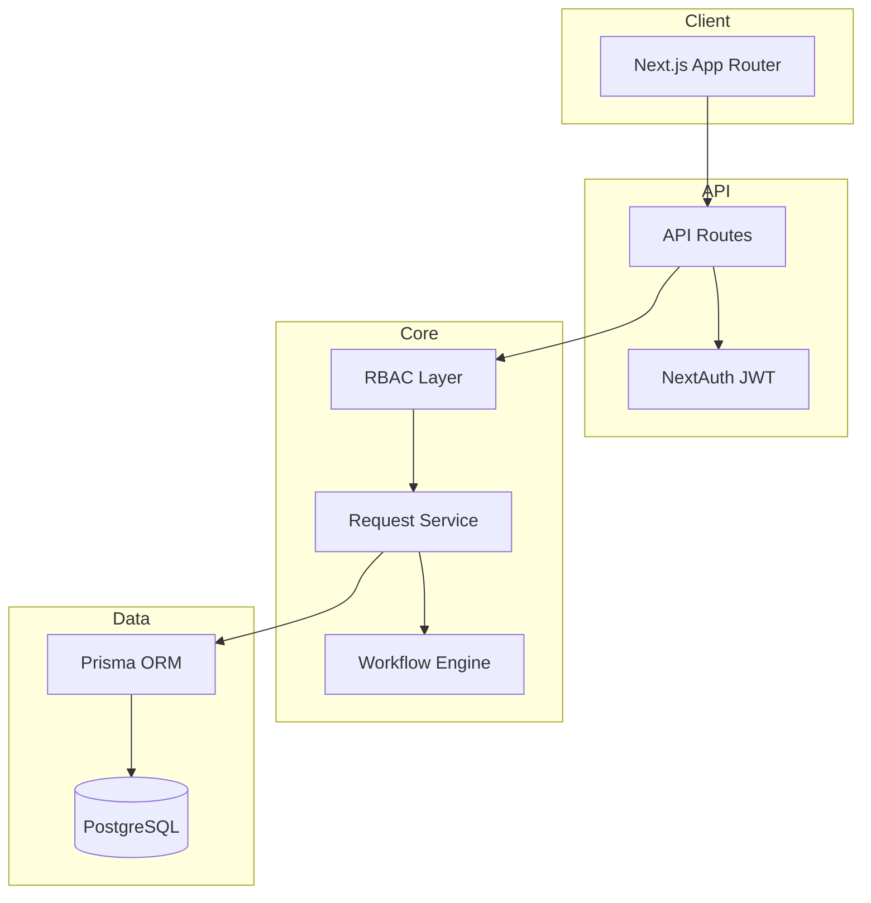
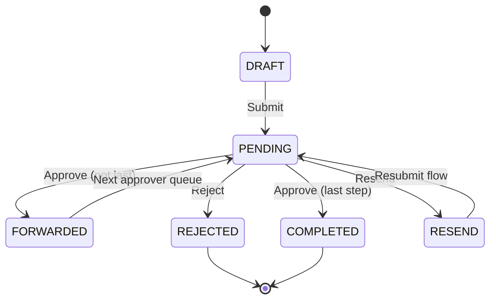

# NFA System Architecture

## 1. High-Level Architecture



## 2. Database ER Logic

### Core Relationships

```
users ──N:1── roles
users ──N:1── departments
departments ──1:1── users (hod)

requests ──N:1── users (raisedBy)
requests ──N:1── departments
requests ──N:1── clubs (optional, CLUB category)
requests ──1:N── request_attachments
requests ──1:N── approval_history
requests ──1:N── remarks
requests ──1:N── workflow_logs

club_authorities ──N:1── clubs
club_authorities ──N:1── users

authority_mapping ──N:1── users (authority holder)
authority_mapping ──N:1── users (assignedBy)

approval_workflow ── defines step sequence per category
```

### Indexing Strategy

- `requests`: `(raisedById)`, `(departmentId)`, `(status)`, `(category)`, `(createdAt)`
- `approval_history`: `(requestId)`, `(createdAt)`
- `notifications`: `(userId, isRead)`
- `audit_logs`: `(entityType, entityId)`, `(createdAt)`

## 3. Workflow Engine

Location: `src/lib/workflow/engine.ts`

| Function | Purpose |
|----------|---------|
| `getWorkflowSteps(category)` | Returns ACADEMIC or CLUB step chain |
| `getInitialStep(category)` | First approver after submit |
| `getNextStep(category, currentStep)` | Next role in chain |
| `getStatusAfterAction(action, isLastStep)` | Maps action → status |
| `buildTimeline(...)` | UI vertical timeline state |

### Step Definitions

**ACADEMIC**: HOD(1) → IQAC(2) → PMSEB(3) → COE(4) → REGISTRAR(5) → OFC(6)

**CLUB**: CLUB_AUTHORITY(1) → IQAC(2) → ... → OFC(6)

Stored in DB table `approval_workflow` for runtime configurability (Registrar can extend).

## 4. RBAC Permission Matrix

| Permission | FAC | HOD | CLUB | IQAC | PMSEB | COE | REG | OFC |
|------------|-----|-----|------|------|-------|-----|-----|-----|
| request:create | ✓ | ✓ | | ✓* | ✓* | ✓* | ✓* | ✓* |
| request:view_own | ✓ | ✓ | | ✓ | ✓ | ✓ | ✓ | ✓ |
| request:view_department | | ✓† | ✓‡ | | | | | |
| request:view_all | | | | ✓ | ✓ | ✓ | ✓ | ✓ |
| request:approve | | ✓† | ✓‡ | ✓ | ✓ | ✓ | ✓ | ✓ |
| analytics:view | | | | | | | ✓ | ✓ |
| authorities:manage | | | | | | | ✓ | ✓ |
| audit:view | | | | | | | ✓ | ✓ |

† Academic only, same department  
‡ Assigned clubs only  
\* HOD can raise own requests

## 5. Request Lifecycle



Each transition writes:
1. `approval_history` row
2. `workflow_logs` entry
3. `audit_logs` entry (on service actions)
4. `notifications` to raiser + next approver

## 6. Authority Reassignment

`authority_mapping` supports:

- **PERMANENT**: Deactivates previous mapping for same role/department
- **TEMPORARY**: `endDate` field for auto-expiry (cron job recommended)

Club authorities use `club_authorities` with optional `expiresAt`.

All changes logged via `createAuditLog`.

## 7. Search & Filter Architecture

`buildRequestWhere(user, filters)` centralizes visibility:

- Role-scoped base filter
- Optional: `status`, `category`, `departmentId`, `search`, `pendingForMe`

API pagination: `page`, `limit` query params.

## 8. Notification Events

| Type | Trigger |
|------|---------|
| REQUEST_SUBMITTED | Faculty submits |
| APPROVAL_PENDING | Routed to next approver |
| APPROVED / REJECTED / RESEND | Action on request |
| AUTHORITY_CHANGED | Authority mapping update |
| COMMENT_ADDED | Remark added |

## 9. UI Design System

- **Primary**: `#1e3a5f` (enterprise navy)
- **Accent**: `#0d9488` (teal)
- **Surface**: `#f8fafc`
- Components: `.nfa-card`, `.nfa-btn-primary`, `.nfa-input`, `.nfa-table`
- Layout: Fixed sidebar (260px) + sticky topbar + KPI grid

## 10. Extension Points

1. **Email notifications**: Hook in `src/lib/notifications.ts`
2. **File uploads**: Add route + `request_attachments` write in create flow
3. **PDF reports**: Server action using `@react-pdf/renderer`
4. **Workflow admin UI**: CRUD on `approval_workflow` for Registrar
5. **SSO**: Replace Credentials provider with SAML/OIDC in `auth.ts`

## 11. Security Considerations

- JWT session (8h max)
- Middleware protects authenticated routes
- `canViewRequest` / `canApproveAtStep` enforced server-side on every mutation
- Never trust client-side role checks alone
- Parameterized Prisma queries (SQL injection safe)

## 12. Deployment Topology

```
[Vercel / Node host] ── Next.js
        │
        ├── PostgreSQL (RDS / Supabase / Neon)
        └── Object storage (attachments)
```

Recommended: separate read replica for analytics queries at scale.
